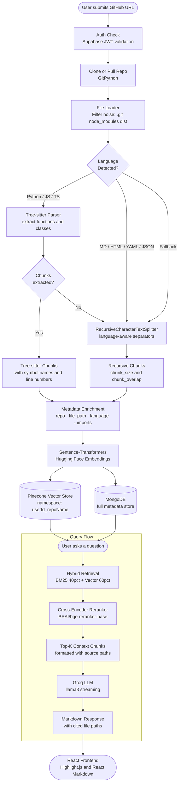

# 🤖 GitHub Assistant

**Live Demo:** [github-assistant-deploy-by4c.vercel.app/dashboard](https://github-assistant-deploy-by4c.vercel.app/dashboard)

A full-stack **Retrieval-Augmented Generation (RAG)** web application that lets you point it at any public GitHub repository and have a natural-language conversation with its codebase. Submit a repo URL, watch it get cloned, parsed, and embedded in seconds, then ask anything — from architecture questions to specific function explanations.

---

## 🗺️ Architecture & Pipeline



---

## ✨ Features

| Feature | Detail |
|---|---|
| **Secure Auth** | Supabase JWT — session management, per-user namespacing |
| **Smart Ingestion** | Clones repos via GitPython, filters out `.git`, `node_modules`, `dist` |
| **Tree-sitter Parsing** | Extracts individual functions and classes (Python, JS, TS) with line numbers |
| **Language-Aware Chunking** | `RecursiveCharacterTextSplitter` for MD, HTML, YAML, JSON, and plain text |
| **Hybrid Retrieval** | BM25 (keyword) + Pinecone (semantic) combined with weighted ensemble |
| **Cross-Encoder Reranking** | `BAAI/bge-reranker-base` reranks initial candidates for precision |
| **Streaming LLM Answers** | Groq API with streaming — answers appear token-by-token |
| **Source Citations** | Every answer cites the exact file path and symbol name |
| **Dual Storage** | Pinecone for fast vector search · MongoDB for full metadata |

---

## 🛠️ Tech Stack

### Frontend

| Layer | Technology |
|---|---|
| Framework | React 18 + Vite |
| Routing | React Router DOM |
| Rendering | React Markdown + Highlight.js |
| Deployment | Vercel |

### Backend

| Layer | Technology |
|---|---|
| API Framework | FastAPI (Python) |
| Auth and DB | Supabase |
| LLM Orchestration | LangChain |
| LLM Provider | Groq (llama3-70b-8192) |
| Embeddings | sentence-transformers (Hugging Face) |
| Vector Store | Pinecone (serverless, cosine similarity) |
| Metadata Store | MongoDB |
| Code Parsing | tree-sitter + tree-sitter-language-pack |
| Git Operations | GitPython |
| Reranker | BAAI/bge-reranker-base (CrossEncoder) |

---

## 📂 Project Structure

```
github-assistant/
├── backend/                    # FastAPI app & Supabase integration
│   ├── routers/
│   │   ├── auth.py             # Login / signup endpoints
│   │   ├── ingest.py           # Repo ingestion trigger
│   │   ├── query.py            # RAG query endpoint
│   │   └── repos.py            # User repo management
│   ├── schemas/                # Pydantic request/response models
│   └── deps.py                 # Auth dependency (JWT guard)
├── chain/
│   ├── embeddings.py           # Sentence-transformer wrapper
│   └── rag_chain.py            # Hybrid retrieval + reranking + LLM chain
├── ingestion/
│   ├── cloner.py               # clone_or_pull via GitPython
│   ├── loader.py               # File filtering & Document loading
│   └── chunker.py              # Tree-sitter + recursive chunking logic
├── vectorstore/
│   └── pinecone_store.py       # Pinecone upsert & load utilities
├── frontend/                   # React + Vite web application
├── main.py                     # FastAPI application entry point
├── config.py                   # Centralised config (chunk size, models, keys)
├── mongodb.py                  # MongoDB client & helpers
├── requirements.txt            # Python dependencies
└── Dockerfile                  # Production container
```

---

## 🚀 Getting Started

### Prerequisites

- Python **3.10+**
- Node.js **v18+**
- [Groq](https://console.groq.com/) API key
- [Pinecone](https://www.pinecone.io/) API key & index name
- [Supabase](https://supabase.com/) project URL & Anon Key
- [MongoDB](https://www.mongodb.com/atlas) connection string

### 1. Clone & Backend Setup

```bash
git clone https://github.com/<your-username>/github-assistant.git
cd github-assistant

# Create and activate a virtual environment
python -m venv venv
source venv/bin/activate       # Windows: venv\Scripts\activate

# Install dependencies
pip install -r requirements.txt
```

Create a `.env` file in the root directory:

```ini
GROQ_API_KEY=your_groq_api_key
GROQ_MODEL=llama3-70b-8192

PINECONE_API_KEY=your_pinecone_api_key
PINECONE_INDEX_NAME=github-rag

SUPABASE_URL=your_supabase_url
SUPABASE_KEY=your_supabase_anon_key

MONGODB_URI=your_mongodb_connection_string
```

Start the backend:

```bash
uvicorn main:app --reload --port 8000
```

### 2. Frontend Setup

```bash
cd frontend

npm install
npm run dev
```

The React app will be served at `http://localhost:5173`.

---

## 🔄 How It Works

1. **Ingest** — User submits a GitHub URL via the dashboard. The backend clones the repo with GitPython and loads all non-ignored source files.
2. **Parse & Chunk** — Python/JS/TS files go through Tree-sitter to extract individual functions and classes. All other file types (MD, HTML, YAML) are split with LangChain's `RecursiveCharacterTextSplitter`.
3. **Embed & Store** — Chunks are embedded with `sentence-transformers` and upserted into a user-namespaced Pinecone index. Full metadata (imports, line numbers, symbol names) is stored in MongoDB.
4. **Query** — On each question, a hybrid retriever (BM25 + Pinecone, weighted 40/60) fetches candidates. A `BAAI/bge-reranker-base` CrossEncoder reranks them for relevance.
5. **Generate** — The top-K reranked chunks are injected into a LangChain prompt and streamed through Groq. Responses include file-path citations rendered with Markdown and syntax highlighting.

---

## 📜 License

This project is licensed under the **MIT License**. See [LICENSE](LICENSE) for details.
